<h1 align="center">实验指导书（二）</h1>


[toc]

## 零、下载实验工程

我们使用UV来方便大家统一版本。如果你使用了我们的镜像，或者使用的是archlinux：

1. **下载UV Python包管理器**

    ```bash
    # （可选）更新软件列表
    sudo pacman -Syy

    # 安装实验所使用的Python包管理器
    sudo pacman -S uv
    ```

    Fedora / RHEL

    ```bash
    sudo dnf install uv
    ```

    其他发行版

    ```bash
    curl -LsSf https://astral.sh/uv/install.sh | sh
    ```
2. **获取实验Git仓库**

    ```bash
    git clone https://github.com/XJTU-NetVerify/sdn-lab2.git
    cd sdn-lab2
    ```

3. **安装依赖和初始化**

    ```bash
    uv sync
    ```

4. **运行OS-Ken App**

    ```bash
    uv run osken-manager simple_switch.py
    ```

    如果你不希望再反复输入`uv run`，你可以使用Python虚拟环境（virtualenv, `venv`）；此后你就可以直接运行：

    ```bash
    # 创建虚拟环境：
    uv venv
    uv sync

    # 创建完虚拟环境后，每次进入新的shell你需要运行：
    source .venv/bin/activate

    # 此时和Conda一样，Shell prompt前面会有`(sdn-lab2)`提示，即说明你在`venv`虚拟环境中。
    # 你可以直接运行osken-manager。
    osken-manager simple_switch.py

    # 如果要退出`venv`虚拟环境：
    deactivate
    ```

## 一、OVS查看交换机流表

- 查看交换机`s1`的流表

```shell
sudo ovs-ofctl dump-flows s1
```

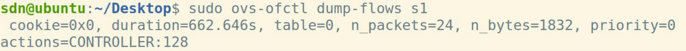


- 只查看`OpenFlow1.3`的流表项

```shell
sudo ovs-ofctl -O OpenFlow13 dump-flows s1
```

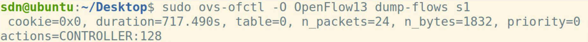

## 二、Wireshark对控制器抓包

启动`WireShark`，监听`Loopback:lo`端口。

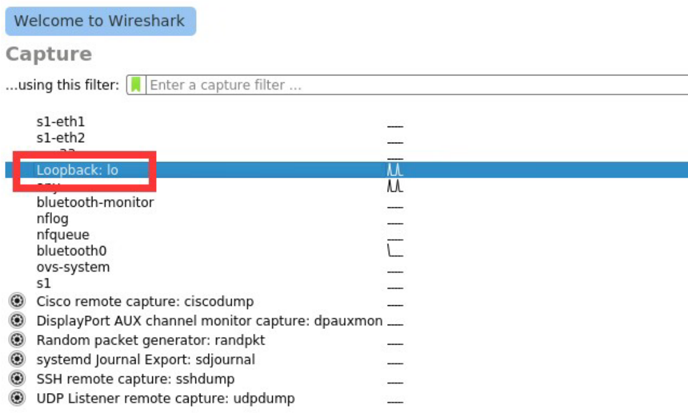

## 三、如何运行OS-Ken APP

Ryu现已不再维护；因此，我们在实验中选用从Ryu fork的，目前正在积极维护中的**OS-Ken**。其大部分内容和Ryu通用。

以运行`OS-Ken`提供的查看拓扑的`APP`为例：

- `mininet`创建拓扑。

```shell
sudo mn --custom topo_2sw_2host.py --topo mytopo --controller remote
#remote表示不用`Mininet`自带的控制器，尝试使用`OS-Ken`等远端控制器。
```

- 运行OS-Ken App。

```shell
uv run osken-manager simple_switch.py
```

## 四、OS-Ken编程示例：简单交换机

### 1. 代码

```python
from os_ken.base import app_manager
from os_ken.controller import ofp_event
from os_ken.controller.handler import MAIN_DISPATCHER, CONFIG_DISPATCHER
from os_ken.controller.handler import set_ev_cls
from os_ken.ofproto import ofproto_v1_3

class L2Switch(app_manager.OSKenApp):
    OFP_VERSIONS = [ofproto_v1_3.OFP_VERSION]

    def __init__(self, *args, **kwargs):
        super(L2Switch, self).__init__(*args, **kwargs)
    
    def add_flow(self, datapath, priority, match, actions):
        dp = datapath
        ofp = dp.ofproto
        parser = dp.ofproto_parser

        inst = [parser.OFPInstructionActions(ofp.OFPIT_APPLY_ACTIONS, actions)]
        mod = parser.OFPFlowMod(datapath=dp, priority=priority, match=match, instructions=inst)
        dp.send_msg(mod)
 
	# add default flow table which sends packets to the controller
    @set_ev_cls(ofp_event.EventOFPSwitchFeatures, CONFIG_DISPATCHER)
    def switch_features_handler(self, ev):
        msg = ev.msg
        dp = msg.datapath
        ofp = dp.ofproto
        parser = dp.ofproto_parser

        match = parser.OFPMatch()
        actions = [parser.OFPActionOutput(ofp.OFPP_CONTROLLER, ofp.OFPCML_NO_BUFFER)]
        self.add_flow(dp, 0, match, actions)

	# handle packet_in message
    @set_ev_cls(ofp_event.EventOFPPacketIn, MAIN_DISPATCHER)
    def packet_in_handler(self, ev):
        msg = ev.msg
        dp = msg.datapath
        ofp = dp.ofproto
        parser = dp.ofproto_parser

        actions = [parser.OFPActionOutput(ofp.OFPP_FLOOD)]
        out = parser.OFPPacketOut(
            datapath=dp, buffer_id=msg.buffer_id, in_port=msg.match['in_port'],actions=actions, data=msg.data)
        dp.send_msg(out)
```

### 2. 运行

- `mininet`创建树状拓扑

```
sudo mn --controller remote --mac --topo=tree,2,2
```

- 将上述代码保存为`simple_switch.py`，启动控制器

```
uv run osken-manager simple_switch.py
```

- 在`mininet`的`CLI`中启动`wireshark`抓取端口`h4-eth0`

```
mininet> h4 wireshark &
```

- 在`mininet`中`h1 ping h3`，查看`wireshark`中关于`h4`的抓包情况

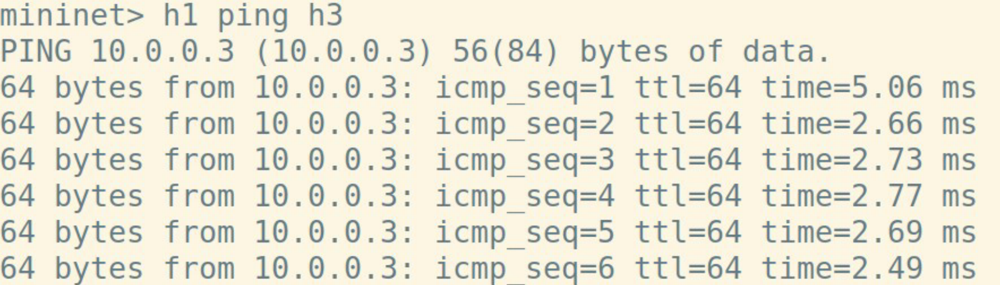

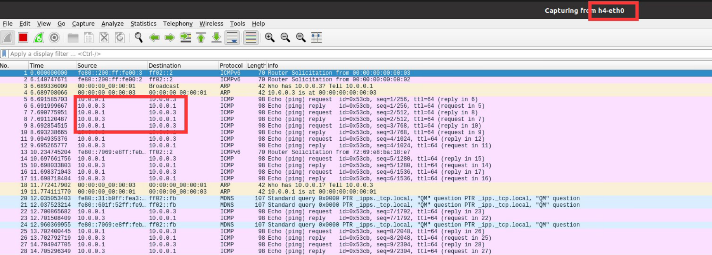

抓包结果显示该交换机存在验证缺陷：`packet_in_handler`函数会将数据包洪泛到交换机的所有端口，故`h1`和`h3`通讯时，`h4`也会收到所有的包。

## 五、实验任务

### 1. 实验任务一：自学习交换机


1969年的`ARPANET`非常简单，仅由四个结点组成。假设每个结点都对应一个交换机，每个交换机都具有一个直连主机，你的任务是实现不同主机之间的正常通信。

前文给出的简单交换机洪泛数据包，虽然能初步实现主机间的通信，但会带来不必要的带宽消耗，并且会使通信内容泄露给第三者。因此，请你**在简单交换机的基础上实现二层自学习交换机，避免数据包的洪泛**。

### 问题说明

- `SDN`自学习交换机的工作流程可以参考：
  	1. 控制器为每个交换机维护一个`mac-port`映射表。
  	1. 控制器收到`packet_in`消息后，解析其中携带的数据包。
  	1. 控制器学习`src_mac - in_port`映射。
  	1. 控制器查询`dst_mac`，如果未学习，则洪泛数据包；如果已学习，则向指定端口转发数据包(`packet_out`)，并向交换机下发流表项(`flow_mod`)，指导交换机转发同类型的数据包。

- 网络拓扑为`topo_1969_1.py`，启动方式：

  ```shell
  sudo ./topo_1969_1.py
  ```

- 可以不考虑交换机对数据包的缓存(`no_buffer`)。

### 代码框架

以下给出代码框架，只需补充关键的若干行实现即可：

```python
from os_ken.base import app_manager
from os_ken.controller import ofp_event
from os_ken.controller.handler import MAIN_DISPATCHER, CONFIG_DISPATCHER
from os_ken.controller.handler import set_ev_cls
from os_ken.ofproto import ofproto_v1_3
from os_ken.lib.packet import packet
from os_ken.lib.packet import ethernet

class Switch(app_manager.OSKenApp):
    
    OFP_VERSIONS = [ofproto_v1_3.OFP_VERSION]
    def __init__(self, *args, **kwargs):
        super(Switch, self).__init__(*args, **kwargs)
        # maybe you need a global data structure to save the mapping
        
    def add_flow(self, datapath, priority, match, actions,idle_timeout=0,hard_timeout=0):
        dp = datapath
        ofp = dp.ofproto
        parser = dp.ofproto_parser
        inst = [parser.OFPInstructionActions(ofp.OFPIT_APPLY_ACTIONS, actions)]
        mod = parser.OFPFlowMod(datapath=dp, priority=priority,
                                idle_timeout=idle_timeout,
                                hard_timeout=hard_timeout,
        						match=match,instructions=inst)
        dp.send_msg(mod)
        
    @set_ev_cls(ofp_event.EventOFPSwitchFeatures, CONFIG_DISPATCHER)
    def switch_features_handler(self, ev):
        msg = ev.msg
        dp = msg.datapath
        ofp = dp.ofproto
        parser = dp.ofproto_parser
        match = parser.OFPMatch()
        actions = [parser.OFPActionOutput(ofp.OFPP_CONTROLLER,ofp.OFPCML_NO_BUFFER)]
        self.add_flow(dp, 0, match, actions)
        
    @set_ev_cls(ofp_event.EventOFPPacketIn, MAIN_DISPATCHER)
    def packet_in_handler(self, ev):
        msg = ev.msg
        dp = msg.datapath
        ofp = dp.ofproto
        parser = dp.ofproto_parser
        
        # the identity of switch
        dpid = dp.id
        # the port that receive the packet
        in_port = msg.match['in_port']
        pkt = packet.Packet(msg.data)
        eth_pkt = pkt.get_protocol(ethernet.ethernet)
        # get the mac
        dst = eth_pkt.dst
        src = eth_pkt.src
        # we can use the logger to print some useful information
        self.logger.info('packet: %s %s %s %s', dpid, src, dst, in_port)
        
        # You need to code here to avoid the direct flooding
        # Have fun!
        # :)
```

### 结果示例

`UCLA ping UTAH`，`UCSB`不再收到相关数据包：

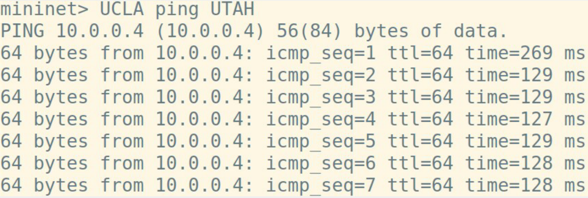

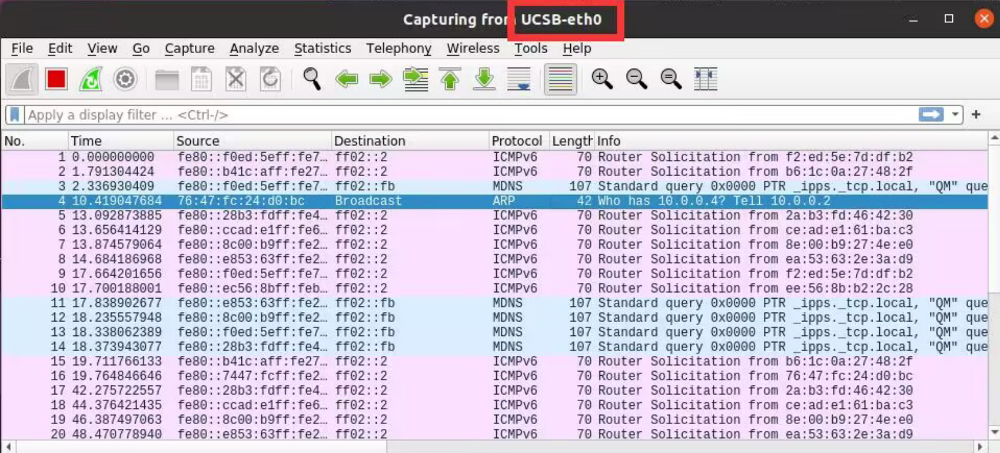

### 2. 实验任务二：处理环路广播

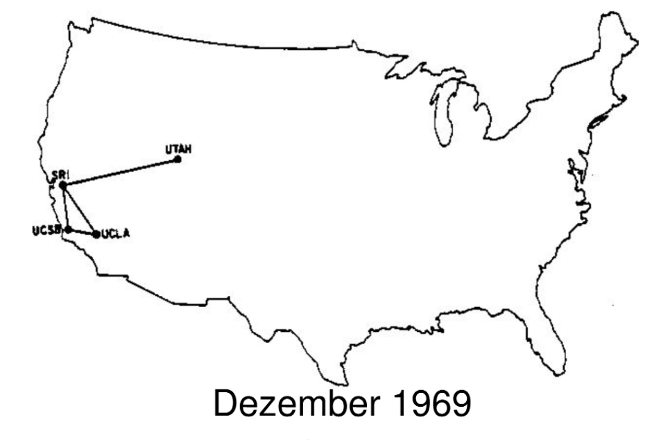


`UCLA`和`UCSB`通信频繁，两者间建立了一条直连链路。在新的拓扑`topo_1969_2.py`中运行自学习交换机，`UCLA`和`UTAH`之间无法正常通信。分析流表发现，源主机虽然只发了很少的几个数据包，但流表项却匹配了上千次；`WireShark`也截取到了数目异常大的相同报文。

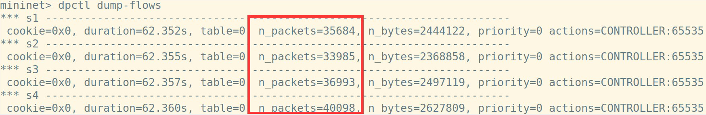

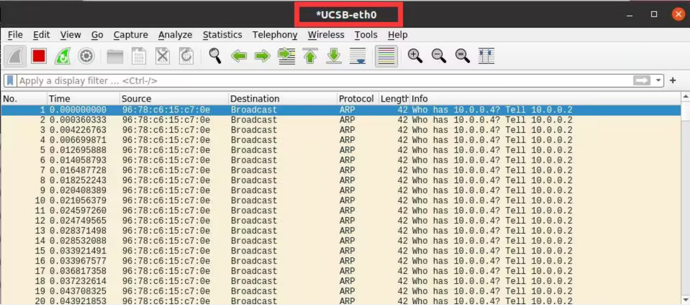

这实际上是`ARP`广播数据包在环状拓扑中洪泛导致的，传统网络利用**生成树协议**解决这一问题。在`SDN`中，不必局限于生成树协议，可以通过多种新的策略解决这一问题。以下给出一种解决思路，请在自学习交换机的基础上完善代码，解决问题：

当序号为`dpid`的交换机从`in_port`第一次收到某个`src_mac`主机发出，询问`dst_ip`的广播`ARP Request`数据包时，控制器记录一个映射`(dpid, src_mac, dst_ip)->in_port`。下一次该交换机收到同一`(src_mac, dst_ip)`但`in_port`不同的`ARP Request`数据包时直接丢弃，否则洪泛。

#### 代码框架

```python
from os_ken.base import app_manager
from os_ken.controller import ofp_event
from os_ken.controller.handler import MAIN_DISPATCHER, CONFIG_DISPATCHER
from os_ken.controller.handler import set_ev_cls
from os_ken.ofproto import ofproto_v1_3
from os_ken.lib.packet import packet
from os_ken.lib.packet import ethernet
from os_ken.lib.packet import arp
from os_ken.lib.packet import ether_types

ETHERNET = ethernet.ethernet.__name__
ETHERNET_MULTICAST = "ff:ff:ff:ff:ff:ff"
ARP = arp.arp.__name__


class Switch_Dict(app_manager.OSKenApp):
    OFP_VERSIONS = [ofproto_v1_3.OFP_VERSION]

    def __init__(self, *args, **kwargs):
        super(Switch_Dict, self).__init__(*args, **kwargs)
        self.sw = {} #(dpid, src_mac, dst_ip)=>in_port, you may use it in mission 2
        # maybe you need a global data structure to save the mapping
        # just data structure in mission 1
        

    def add_flow(self, datapath, priority, match, actions, idle_timeout=0, hard_timeout=0):
        dp = datapath
        ofp = dp.ofproto
        parser = dp.ofproto_parser
        inst = [parser.OFPInstructionActions(ofp.OFPIT_APPLY_ACTIONS, actions)]
        mod = parser.OFPFlowMod(datapath=dp, priority=priority,
                                idle_timeout=idle_timeout,
                                hard_timeout=hard_timeout,
                                match=match, instructions=inst)
        dp.send_msg(mod)

    @set_ev_cls(ofp_event.EventOFPSwitchFeatures, CONFIG_DISPATCHER)
    def switch_features_handler(self, ev):
        msg = ev.msg
        dp = msg.datapath
        ofp = dp.ofproto
        parser = dp.ofproto_parser
        match = parser.OFPMatch()
        actions = [parser.OFPActionOutput(ofp.OFPP_CONTROLLER, ofp.OFPCML_NO_BUFFER)]
        self.add_flow(dp, 0, match, actions)

    @set_ev_cls(ofp_event.EventOFPPacketIn, MAIN_DISPATCHER)
    def packet_in_handler(self, ev):
        msg = ev.msg
        dp = msg.datapath
        ofp = dp.ofproto
        parser = dp.ofproto_parser

        # the identity of switch
        dpid = dp.id
        # the port that receive the packet
        in_port = msg.match['in_port']
        pkt = packet.Packet(msg.data)
        eth_pkt = pkt.get_protocol(ethernet.ethernet)
        if eth_pkt.ethertype == ether_types.ETH_TYPE_LLDP:
            return
        if eth_pkt.ethertype == ether_types.ETH_TYPE_IPV6:
            return
        # get the mac
        dst = eth_pkt.dst
        src = eth_pkt.src
        # get protocols
        header_list = dict((p.protocol_name, p) for p in pkt.protocols if type(p) != str)
        if dst == ETHERNET_MULTICAST and ARP in header_list:
            pass
        # you need to code here to avoid broadcast loop to finish mission 2
        
        # self-learning
        # you need to code here to avoid the direct flooding
        # having fun
        # :)
        # just code in mission 1

```

#### 结果示例

解决`ARP`数据包在环状拓扑中的洪泛问题后，`UCLA`和`UTAH`之间可以`ping`通，并且流表项的匹配次数明显减少：

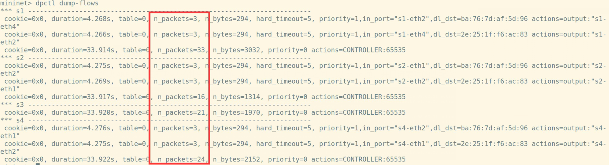

### 3. 附加题

实验任务二只给出了一种参考方案，`SDN`中还有多种方案可供选择，请尝试设计实现一种新的策略解决环路广播问题。

附加题占分值较小，主要面向学有余力的同学，请结合自身实际决定是否选做。
### 4. 拓展资料

- SDN论坛：[sdnlab](https://www.sdnlab.com/)
- 关于Mininet的更多资料：[Mininet Doc](https://github.com/mininet/mininet/wiki/Documentation)，[Mininet API](http://mininet.org/api/annotated.html)
- 关于OS-Ken App开发的更多资料：[OS-Ken Documentation](https://docs.openstack.org/os-ken/latest/) [Ryu Book](https://osrg.github.io/ryu-book/en/html/index.html)